# GitKraken Guide

This guide if for using GitKraken with Camelot Unchained.  It is not a complete GitKraken tutorial nor trying to be.

The workflow presented here is just one possible workflow.

# Prerequisites

* Have a git hub account
* Have forked http://github.com/CUModSquad/Camelot-Unchained/

# Installing GitKraken

Download and install from here: [GitKraken Download](https://www.gitkraken.com/download)

# Running GitKraken for the first time

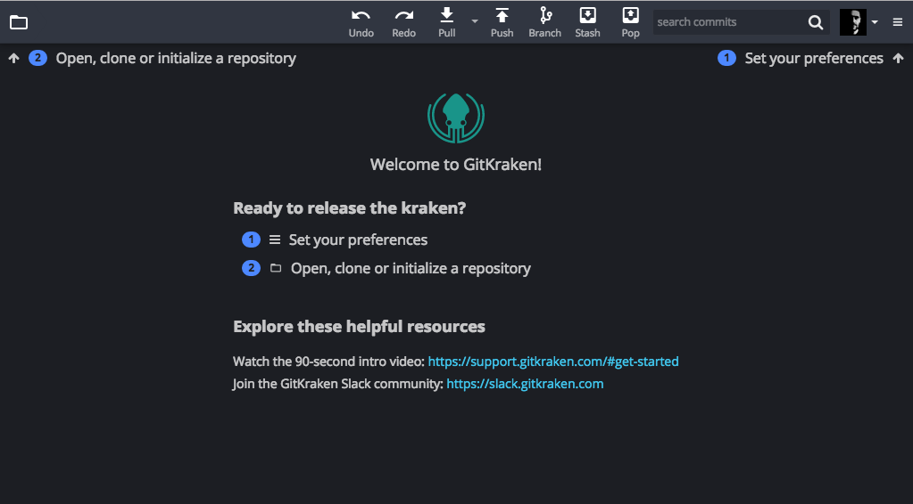

# Clone your fork

The first step is to clone your fork of **Camelot-Unchained**. To do this click on the folder icon top left to open to the **Repository Management** dialog...

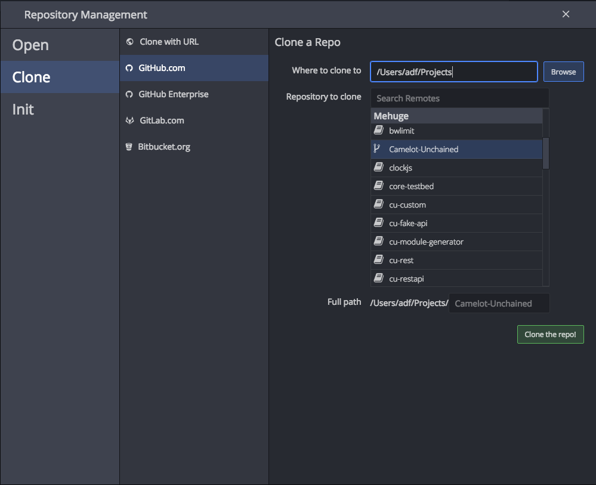

and select **Clone** then **GitHub.com**.  Then select a folder where to clone to, and select your fork of **Camelot-Unchained** from the list and click the green **Clone the Repo!** button.

Click **Open Now** to open the cloned repository.

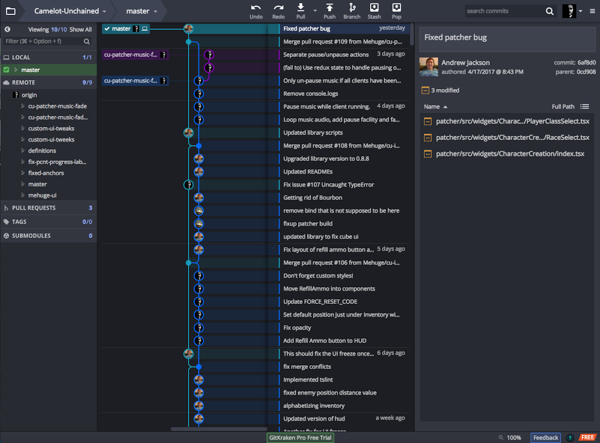

# Adding a remote

The next step is to add ``CUModSquad/Camelot-Unchained`` as a remote.  Hover the mouse over the **REMOTE** section title in the left view, and a green [+] icon will appear.  When it does, click it.

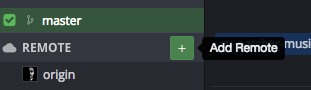

This will open up the **Add Remote** dialog.

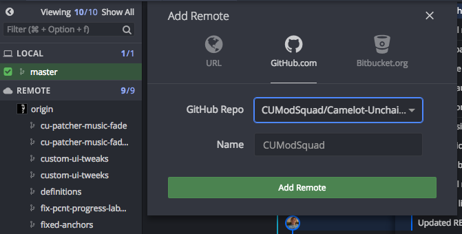

Make sure **GitHub.com** is selected then select ``CUModSquad/Camelot-Unchained`` from the dropdown menu and name your remote ``CUModSquad`` (you can choose a different name if you want).  Then click the green **Add Remote** button.

The result should be that you can now see CUModSquad listed in the **REMOTE** section.

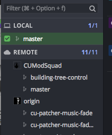

# Creating a branch

At this point you are ready to start work on a change to the UI with a view to submitting that change to CSE/CUModSquad for consideration.  The first thing to do is to create your branch.

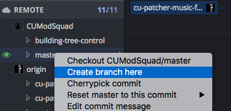

First locate ``CUModSquad/master`` in the **REMOTE** list and right click it, and select **Create branch here** this will open an input box in the central view asking for a branch name.

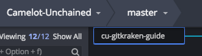

Enter a name, something meaningful both to you and to and to CSE.  For instance, if working on a specific issue, then you could call it ``cu-issue-NNNN`` where NNNN is the issue number.  Or if its just something you are fixing, perhaps ``cu-fix-something`` where something is the thing you are fixing.  Or if its a new feature ``cu-feature-what`` etc.  There are no rigid rules, just be sensible.

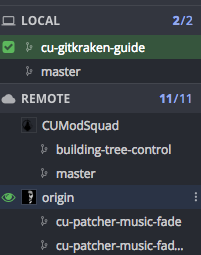

Having created your branch it should now appear under **LOCAL**.

*Now it is time to go and do your thing, perform your magic, produce your masterpiece!!*

# Welcome back, your masterpiece is ready, time to commit.

It is actually good to commit litle and often, as it means if you screw something up, you have something to go back to.  But for a small change you may feel you can make the whole change in one commit.

Anyway, so its time to commit your work to your *local* repository.

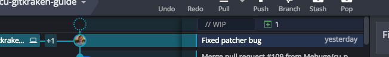

At the top of the center view you will notice a WIP line which indicates there are local, uncommitted changes.  Click on this line to see what those changes are.

**Unstaged Files** are files that have been changed in the working copy but have not yet been selected to be committed.
**Staged Files** are those files which have already been selected to be included in this commit.

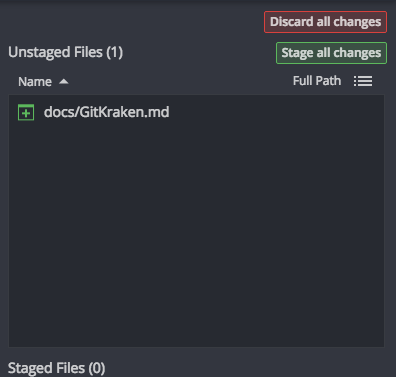

Click on a file in either Unstaged or Staged windows and the center view will display the differences between the working copy and your local branch.

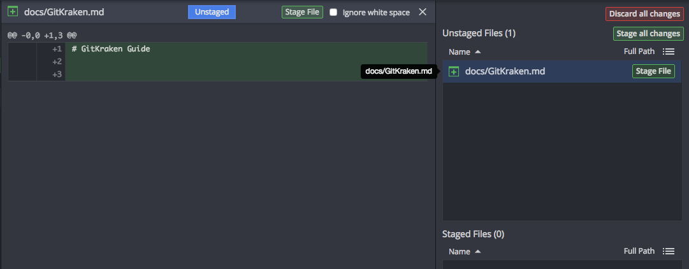

It is possible to stage (select for committing) individual chunks (or Hunks as they are known) of code and even individual lines, so you can ignore some of the changes in your working copy if you wish, perhaps because they are not needed or because you will commit them later.

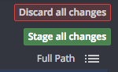

In this guild, we will stage all changes using the **Stage All Changes** button at the top of the **Unstaged Files** section.  This will move all the files listed in **Unstaged Files** into the **Staged Files** section.

Note: If you stage something by mistake, simply go to the **Staged Files** section and unstage it.

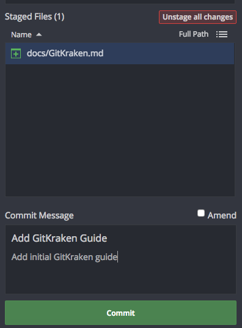

With the files/changes you want to commit staged, it is time to enter a commit **Summary** and optionally a description.  The commit Summary should be short, very short.  It should convey what the commit is about in as few words as possible.  The description can go into more detail if necessary.  Then press the big green **Commit** button.

Repeat this process as many times as necessary in order to commit the changes you want to submit.

# Push your changes to your repo

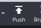

You can push your branch, including your local commits, to your repo (the origin) either by pressing the Push Button while your branch is current, or by right clicking your branch and selecting the **Push** option.

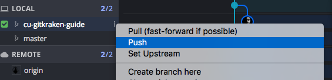

As this will be your first push after creating the branch, ``GitKraken`` will prompt you to add an upstream which will be ``origin`` and the name of your branch.  Then click the green **Submit**.

You can repeat the commit push cycle as many times as necessary.

# Creating a pull request

When you are finally ready to submit your changes to CUModSquad for review, you need to creat a pull request.  You can do this on GitHub.com right after you have pushed your changes to your repo.  Navigate to your repo or to http://github.com/CUModSquad/Camelot-Unchained/ and you should see a yellow box with your branch in it with a big green **Compare & pull request** button.  Click it!

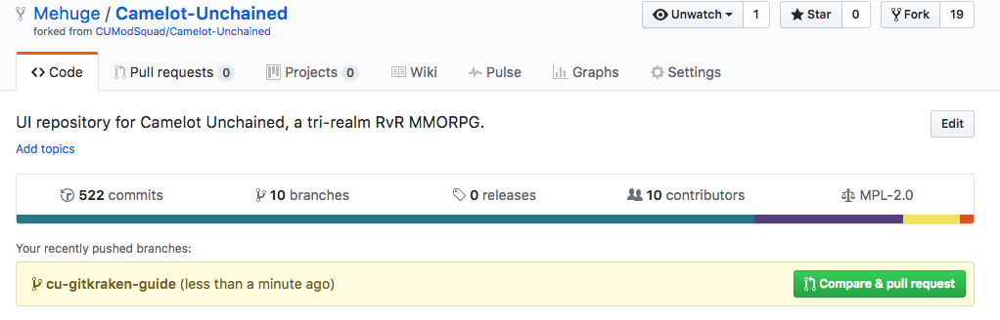

This will take you to a screen where you can review your changes, flesh out the description and alter the title of the pull request before actually creating it.

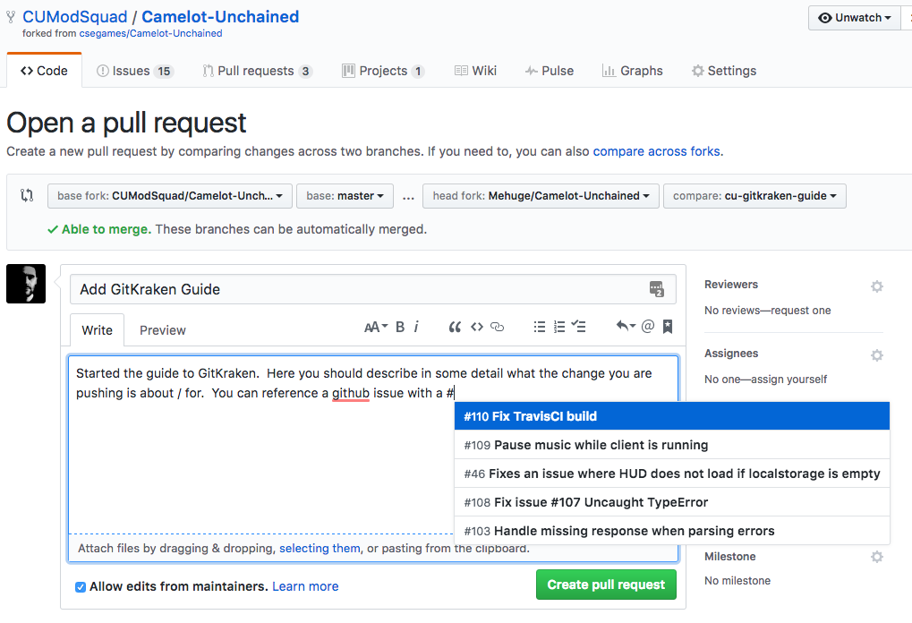

Once you are completely happy with your pull request, click the big green **Create Pull Request** button and voila! you have just submitted your first change to ``CUModSquad``.

